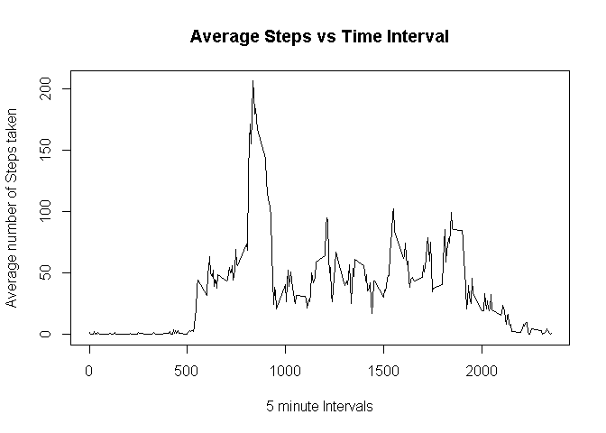
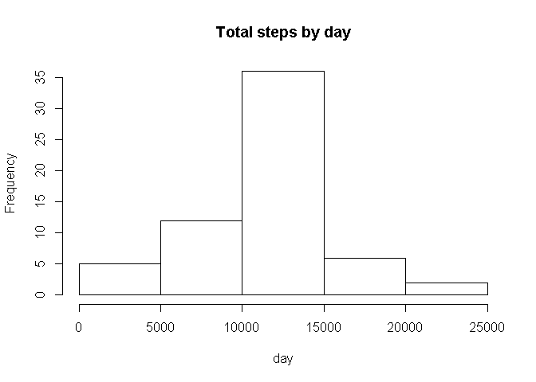
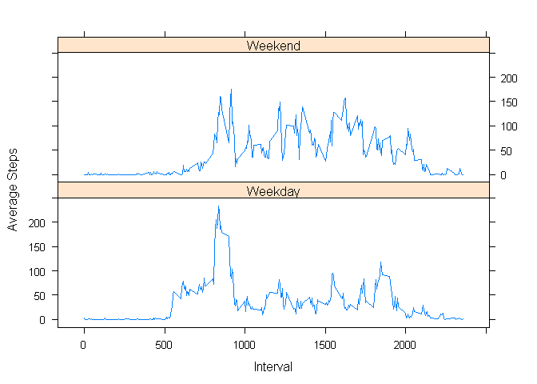

# Reproducible Research:Activity Analysis

## Including the necessary libraries

```r
library("lattice")
```

```
## Warning: package 'lattice' was built under R version 3.3.2
```

## Loading and preprocessing the data

Load the Data and converting the date Format

```r
activitydata <-read.csv("activity.csv",header = TRUE,sep=",",dec=".")
activitydata$date <- as.Date(activitydata$date,"%Y-%m-%d")
```

## What is mean total number of steps taken per day?

Getting the Aggregate of the data

```r
aggdata <- aggregate(steps~date, data=activitydata,sum, na.rm=TRUE)

mean.steps<-mean(aggdata$steps,na.rm = TRUE)

median.steps <- median(aggdata$steps)
```

## What is the average daily activity pattern?

Make a time series plot (i.e. type = "l") of the 5-minute interval (x-axis) and the average number of steps taken, averaged across all days (y-axis)

```r
time_series <- tapply(activitydata$steps,activitydata$interval, mean, na.rm = TRUE)

plot(row.names(time_series),time_series,type="l",xlab = "5 minute Intervals",
     ylab = "Average number of Steps taken",main = "Average Steps vs Time Interval")
```

<!-- -->

Which 5-minute interval, on average across all the days in the dataset,contains the maximum number of steps?

```r
max_interval <- which.max(time_series)
names(max_interval)
```

```
## [1] "835"
```

## Imputing missing values

Initially we find the number of missing values

```r
missingvalues<- length(which(is.na(activitydata)))
activity_NA <-sum(is.na(activitydata))
```

Then the number of steps are aggreagated by the time interval

```r
stepsAverage <- aggregate(steps ~ interval, data = activitydata, FUN = mean)
```

We create a new numeric vector called imputeNA and int he coming steps we 
impute the missing values

```r
imputeNA <- numeric()
for (i in 1:nrow(activitydata)) {
        obs <- activitydata[i, ]
        if (is.na(obs$steps)) {
                steps <- subset(stepsAverage, interval == obs$interval)$steps
        } else {
                steps <- obs$steps
        }
        imputeNA <- c(imputeNA, steps)
}

activitydata_noNA <- activitydata

activitydata_noNA$steps <- imputeNA
```

Then for the imputed data is aggregated based on the date and the required histogram is plotted and the summary statistics are calculated.

```r
aggdata_noNA <- aggregate(steps~date, data = activitydata_noNA,sum, na.rm=TRUE)

hist(aggdata_noNA$steps, main = "Total steps by day", xlab = "day")
```

<!-- -->

```r
mean(aggdata_noNA$steps)
```

```
## [1] 10766.19
```

```r
median(aggdata_noNA$steps)
```

```
## [1] 10766.19
```

## Are there differences in activity patterns between weekdays and weekends?

Finding the days of the week for the dates specified in the  data

```r
days<- weekdays(activitydata$date)
```

Classifying the dates into two factor levels containing Weekday or Weekend.

```r
dayslevels<- vector()
for (i in 1:nrow(activitydata)) {
                if (days[i] == "Saturday") {
                        dayslevels[i] <- "Weekend"
                } else if (days[i] == "Sunday") {
                        dayslevels[i] <- "Weekend"
                } else {
                        dayslevels[i] <- "Weekday"
                }
        }


activitydata$days <- dayslevels

activitydata$days <- factor(activitydata$days)
```

Aggregating the data based on teh interval and days 

```r
stepsavgbyday <-aggregate(steps~interval + days, data = activitydata,mean)
names(stepsavgbyday)<-c("Interval","Days","Steps")
```

Panel plot showing the difference between weekend and Weekday

```r
xyplot(Steps ~ Interval|Days,stepsavgbyday,type = "l",layout=c(1,2),
       xlab="Interval",ylab="Average Steps")
```

<!-- -->
